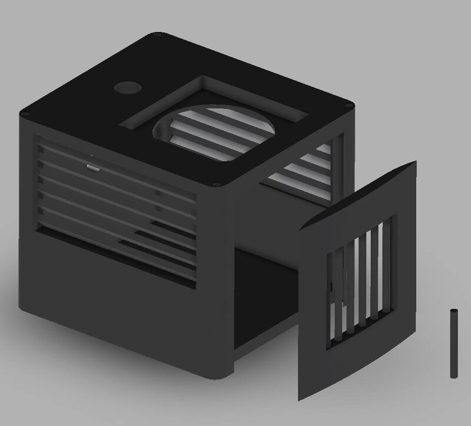

# scrubber

A solar-powered air-quality monitoring station built on an Arduino MKR1000. Reads particulate matter, temperature, and humidity, then pushes the values to ThingSpeak over Wi-Fi.



## Features

- Measures PM1.0, PM2.5, and PM10 particulate concentrations (ug/m^3)
- Measures ambient temperature and relative humidity
- Publishes all five fields to a ThingSpeak channel over Wi-Fi
- Sleeps for 60 seconds between samples to conserve battery
- Runs off a LiPo cell topped up by a small solar panel

## Hardware

- Arduino MKR1000
- DFRobot SEN0177 laser dust sensor (PM1.0 / PM2.5 / PM10, UART)
- Grove DHT22 temperature and humidity sensor
- 2000 mAh lithium polymer battery
- 3W solar panel (138 x 160 mm, Seeed Studio)
- DFRobot Solar LiPo charger

## Pinout

| MKR1000 pin | Connects to                  |
|-------------|------------------------------|
| D2          | DHT22 data                   |
| Serial1 RX  | SEN0177 TX (9600 baud)       |
| 5V / GND    | Sensor power and ground      |
| LiPo header | Solar charger battery output |

## Setup

In the Arduino IDE, install the **MKR1000** board (Tools -> Board Manager -> *Arduino SAMD Boards*) and select it as the target.

Install these libraries via the Library Manager:

- `WiFi101`
- `ThingSpeak`
- `DHT sensor library` (Adafruit)
- `ArduinoLowPower`

Create your `secrets.h` from the template before building:

```bash
cp secrets.h.example secrets.h
```

Then fill in your Wi-Fi credentials and ThingSpeak channel details:

```c
#define SECRET_SSID         "your-ssid"
#define SECRET_PASS         "your-wifi-password"
#define SECRET_CH_ID        123456
#define SECRET_WRITE_APIKEY "your-thingspeak-write-key"
```

`secrets.h` is gitignored.

## Build & flash

1. Connect the MKR1000 over USB.
2. Open `air-pollution-index-station.ino` in the Arduino IDE.
3. Select the matching board and serial port under **Tools**.
4. Click **Upload**.

The board will connect to Wi-Fi on boot, then loop: read sensors, push to ThingSpeak, sleep 60 s (`ArduinoLowPower`).

## License

MIT &copy; Jeon Wonje
